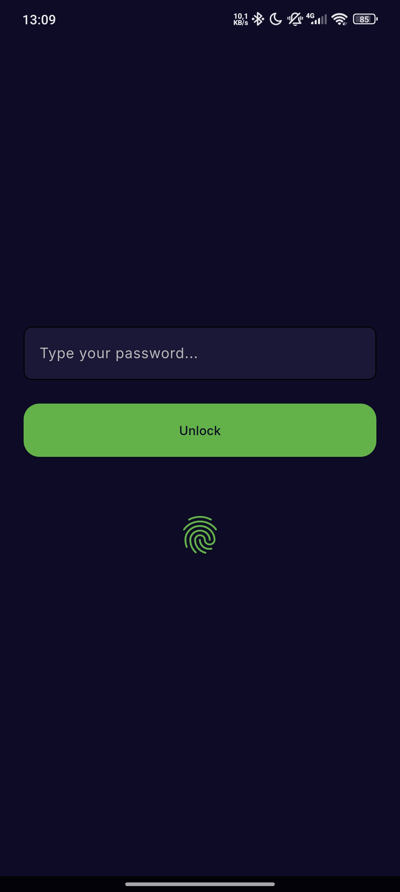
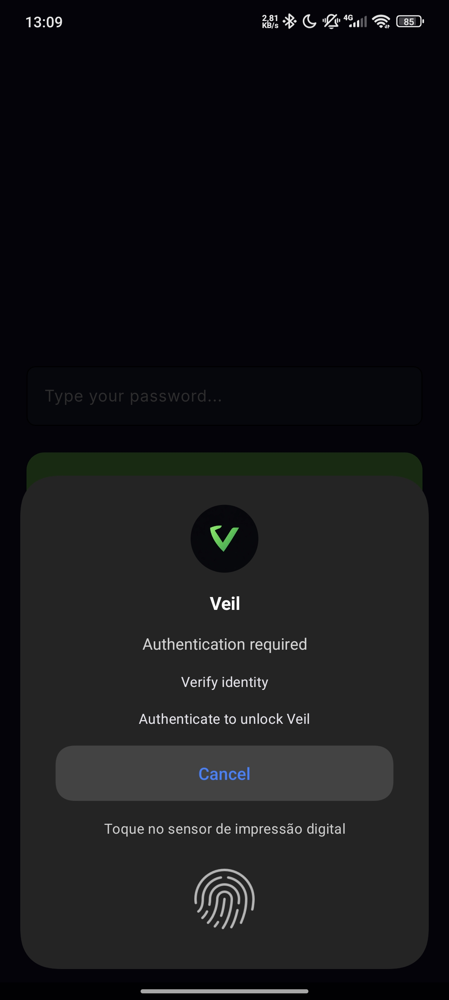
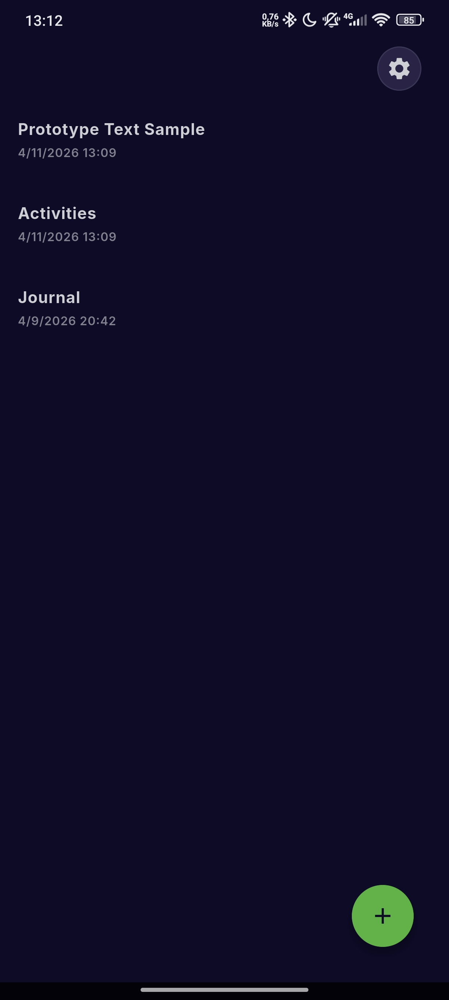
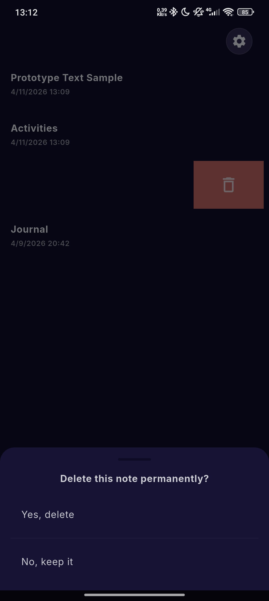
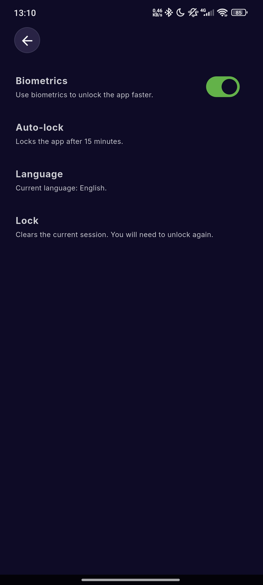
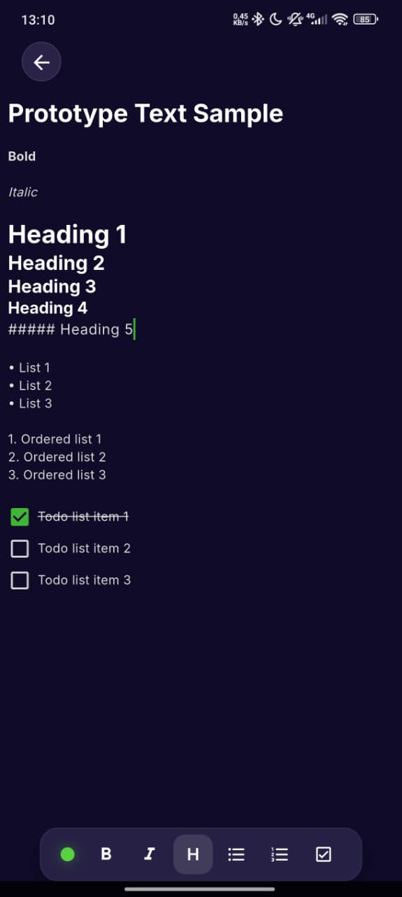

# Veil

**Privacy without effort.**

Veil is an Android-first, local-first encrypted notes app for people who want their notes to stay under their control.

Your notes are encrypted on your device and stored in the app's private storage. Veil does not require an account or cloud sync.

[Download the latest Android beta](https://github.com/veil-notes/app/releases) - [Report a bug](https://github.com/veil-notes/app/issues/new/choose) - [Join the discussion](https://github.com/veil-notes/app/discussions)

## Screenshots

  
  
  

  
  
  

## Download and install

Veil is currently distributed as an Android beta through [GitHub Releases](https://github.com/veil-notes/app/releases).

For most modern Android phones, download the arm64-v8a APK. Older 32-bit devices may need armeabi-v7a; x86_64 is mainly intended for emulators and specific x86 devices.

Android may ask you to allow installation from unknown sources. Releases are experimental, so do not use Veil as the only copy of critical data.

## Security and privacy

- Notes are encrypted locally before they are written to storage.
- Android notes are kept in the app-private documents directory.
- Your master password is not recoverable. Losing it means losing access to the vault.
- Veil has not received an external security audit yet.

This is an early beta. Please test with non-critical data and do not assume that the current implementation has been independently verified.

## Contributing

Contributions are welcome, especially bug fixes, tests, documentation improvements, accessibility work, and localization updates.

Please read [CONTRIBUTING.md](CONTRIBUTING.md) before opening a pull request. For questions and ideas, use [GitHub Discussions](https://github.com/veil-notes/app/discussions); use [Issues](https://github.com/veil-notes/app/issues) for reproducible bugs and actionable tasks.

Please do not report security vulnerabilities in public issues. See [SECURITY.md](SECURITY.md).

## Technical reference

For the maintained technical document, see [docs/ARCHITECTURE.md](docs/ARCHITECTURE.md).

## License

Veil is free and open-source software licensed under the [GNU General Public License v3.0](LICENSE).

See also [CODE_OF_CONDUCT.md](CODE_OF_CONDUCT.md) for the standards expected in the community.
